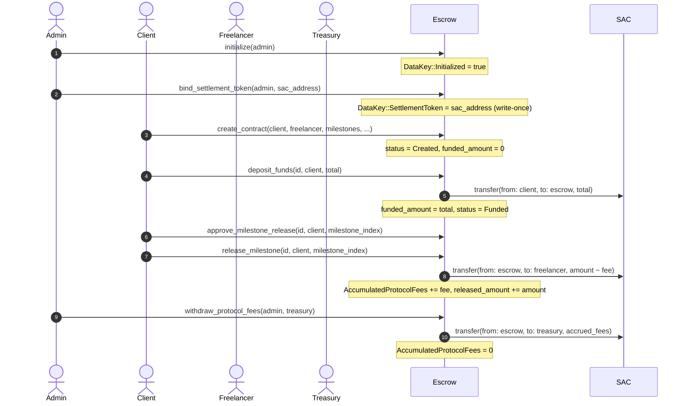

# SAC Custody and Settlement-Token Lifecycle

This document describes the custody model for the TalentTrust Escrow contract: which
entrypoint moves funds in which direction, the one-token-per-escrow assumption, where
accrued protocol fees reside until withdrawn, and the accounting invariant that
integrators and auditors can rely on.

Cross-check source: [`contracts/escrow/src/lib.rs`](../../contracts/escrow/src/lib.rs)

---

## One-Token-per-Escrow Assumption

Each deployed escrow instance custodies **exactly one** Stellar Asset Contract (SAC)
token.  The token address is stored under `DataKey::SettlementToken` and must be bound
before any fund-moving entrypoint can execute.  There is no support for multi-token
escrow; all milestone amounts are denominated in stroops of this single token.

---

## Entrypoint Fund-Flow Map

| Entrypoint | Source | Destination | Amount |
|---|---|---|---|
| `bind_settlement_token` | — | — | No transfer; records the SAC address in persistent storage. |
| `deposit_funds` | Client wallet | Escrow contract address | Exact `amount` argument (must equal total unfunded milestones). |
| `release_milestone` | Escrow contract address | Freelancer wallet | `milestone.amount − protocol_fee`; fee is retained inside the escrow contract. |
| `refund_unreleased_milestones` | Escrow contract address | Client wallet | Sum of milestone amounts for each requested unreleased index. |
| `cancel_contract` | Escrow contract address | Client wallet | All funded-but-unreleased amounts returned. |
| `withdraw_protocol_fees` | Escrow contract address | Protocol treasury | Accumulated fee balance (`DataKey::AccumulatedProtocolFees`). |

---

## Token-Binding Step (`bind_settlement_token`)

`bind_settlement_token(admin, token)` is the **write-once** configuration step that
records the SAC address under `DataKey::SettlementToken`.

- Requires `initialize` to have been called (`NotInitialized` error otherwise).
- Requires the caller to be the stored admin (`UnauthorizedRole` otherwise).
- Rejects a second call when a token is already bound (`SettlementTokenAlreadyBound`).
- `set_settlement_token` is a deprecated alias retained for backward compatibility;
  new code must call `bind_settlement_token`.

After binding, every fund-moving entrypoint reads this key via
`Escrow::read_settlement_token`.  If the key is absent at call time the contract panics
with `SettlementTokenNotConfigured`.

---

## Deposit (`deposit_funds`)

```
Client wallet ──[SAC transfer]──► Escrow contract address
```

1. Validates `amount > 0`, contract exists, caller is the client, and contract is in
   `Created` status.
2. Calls `token::Client::transfer(from: client, to: escrow_address, amount)` — the SAC
   deducts from the client's on-chain balance and credits the escrow contract address.
3. Updates `contract.funded_amount += amount` and `contract.total_deposited += amount`.
4. Transitions status to `Funded` once `funded_amount >= sum(milestones)`.

The contract address itself holds the balance; there is no separate vault or sub-account.

---

## Milestone Release (`release_milestone`)

```
Escrow contract address ──[SAC transfer, net of fee]──► Freelancer wallet
```

1. Validates: contract is `Funded`, milestone not already released or refunded,
   caller has the required `ReleaseAuthorization` role, approvals are satisfied.
2. Computes `fee = milestone.amount × fee_bps / 10 000`.
3. Transfers `milestone.amount − fee` from the escrow address to the freelancer.
4. Adds `fee` to `DataKey::AccumulatedProtocolFees` (in-contract commingled balance).
5. Updates `contract.released_amount += milestone.amount`.
6. If all milestones are released or refunded, transitions status to `Completed`.

Protocol fees are **not** moved out of the contract immediately; they remain commingled
with the escrow balance until `withdraw_protocol_fees` is called.

---

## Refund (`refund_unreleased_milestones`)

```
Escrow contract address ──[SAC transfer]──► Client wallet
```

1. Requires client auth and a non-empty, deduplicated list of milestone indices.
2. Rejects any index that is already released or refunded.
3. Checks `available_balance >= total_refund_amount` where
   `available_balance = funded_amount − released_amount − refunded_amount`.
4. Transfers the summed refund amount from the escrow address to the client.
5. Updates `contract.refunded_amount += total_refund_amount`.
6. Transitions to `Refunded` (all milestones refunded) or `Completed` (mix of released
   and refunded) when no unreleased milestone remains.

---

## Cancel Contract (`cancel_contract`)

Behaves like a bulk refund of all unfunded or unreleased milestones.

```
Escrow contract address ──[SAC transfer, all unreleased]──► Client wallet
```

Transitions status to `Cancelled`.

---

## Protocol-Fee Withdrawal (`withdraw_protocol_fees`)

```
Escrow contract address ──[SAC transfer, accumulated fees]──► Treasury address
```

Only the protocol admin may call this entrypoint.  It reads
`DataKey::AccumulatedProtocolFees`, transfers that amount from the escrow address to the
configured treasury, and resets the counter to zero.

---

## Balance / Accounting Invariant

At any point in a contract's lifetime the following invariant must hold:

```
escrow_sac_balance == funded_amount − released_amount − refunded_amount + accrued_fees
```

where:
- `funded_amount` = total deposited by the client (sum of all `deposit_funds` calls).
- `released_amount` = gross milestone amounts passed to the freelancer (before fee
  deduction); fees remain in the contract and are counted in `accrued_fees`.
- `refunded_amount` = sum of all milestone amounts returned to the client.
- `accrued_fees` = `DataKey::AccumulatedProtocolFees` — protocol fees retained in-contract
  from prior milestone releases but not yet withdrawn.

This invariant is enforced by `AccountingInvariantViolated` checks throughout the
codebase.  Auditors should verify it holds after every state-mutating transaction.

---

## Full Lifecycle Sequence Diagram



---

## Failure Modes

| Scenario | Error |
|---|---|
| `deposit_funds` / `release_milestone` called before `bind_settlement_token` | `SettlementTokenNotConfigured` |
| `bind_settlement_token` called a second time | `SettlementTokenAlreadyBound` |
| Any fund-moving call before `initialize` | `NotInitialized` |
| Caller not the expected role (client / admin) | `UnauthorizedRole` |
| Contract is paused | `ContractPaused` |
| Deposit while status is not `Created` | `InvalidState` |
| Release while status is not `Funded` | `InvalidState` |
| Available balance less than requested amount | `InsufficientFunds` |

---

## Security Notes for Integrators

1. **Single-token deployment**: Deploy one escrow contract per currency.  Binding a
   different SAC after the first binding is rejected; migration requires deploying a new
   contract.
2. **Commingled protocol fees**: Accrued fees sit in the escrow contract's own SAC
   balance.  The balance invariant above accounts for them.  Draining `withdraw_protocol_fees`
   regularly avoids confusion when auditing the contract balance.
3. **Client auth on deposit**: The SAC `transfer` in `deposit_funds` requires the
   client's signature (`require_auth`).  An escrow contract cannot pull funds without
   explicit client authorisation per transaction.
4. **Atomicity**: State updates and SAC transfers occur in the same Soroban transaction.
   A failed SAC transfer (e.g., insufficient client balance) leaves contract state
   unchanged.
5. **Overflow protection**: All arithmetic uses `safe_add_amounts` /
   `safe_subtract_amounts` wrappers; overflow panics with `PotentialOverflow` before any
   state or balance is modified.
